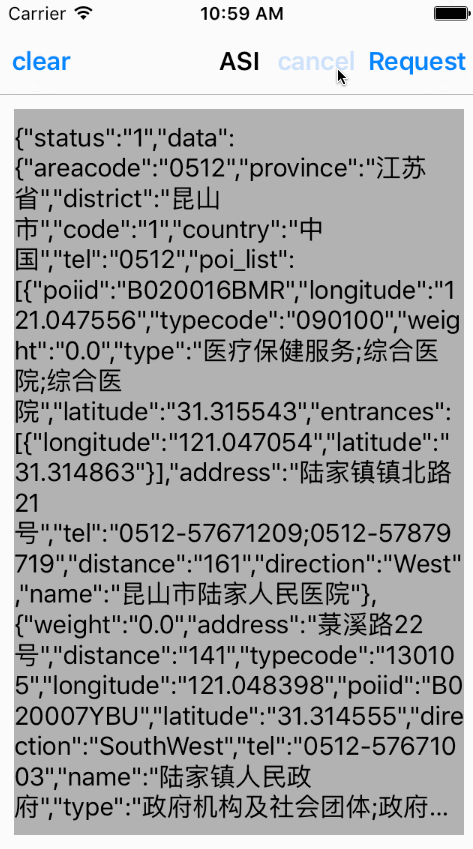

# SYASIRequest
使用ASIHTTPRequest、SBJON进行二次封装网络请求库进行网络请求。

##配置
 * 1 添加ASIHttpRequest库文件
 * 2 添加6个动态库：
  * libxml
  * CFNetwork
  * libz
  * CoreGraphics
  * MobileCoreServices
  * SystemConfiguration
  * libxml
  * 添加方法：项目名称-TARGETS-项目-Build Phases-Link Binary With Libraries-"+"
 * 3 设置Search Path
  * 设置方法：项目名称-TARGETS-项目-Build Settings-Search Paths-Header Search Paths（${SDK_DIR}/usr/include/libxml2）

##使用说明

~~~ javascript

// 导入封装类头文件
#import "SYASIRequest.h"

// 网络请求
// 1 没有parameter时自适配为GET请求
[[SYASIRequest shareRequest] sendRequest:url parameter:nil target:self didFinished:^(id obj) {
    NSString *text = [obj JSONRepresentation];
    self.label.text = text;
} didFailed:^(NSError *error) {
    self.label.text = [NSString stringWithFormat:@"error = %@", error];
}];

// 或2 用户配置GET，或POST请求
[[SYASIRequest shareRequest] sendRequest:url parameter:nil requestType:ASIRequestGET target:self didFinished:^(id obj) {
    NSString *text = [obj JSONRepresentation];
    self.label.text = text;
} didFailed:^(NSError *error) {
    self.label.text = [NSString stringWithFormat:@"error = %@", error];
}];

// 取消网络请求
[[SYASIRequest shareRequest] cancelASIRequest:self];

~~~

#效果图

